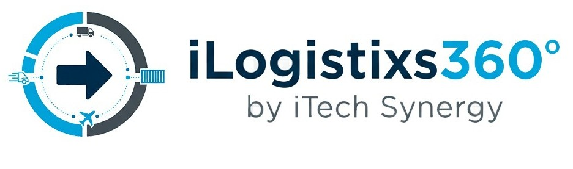
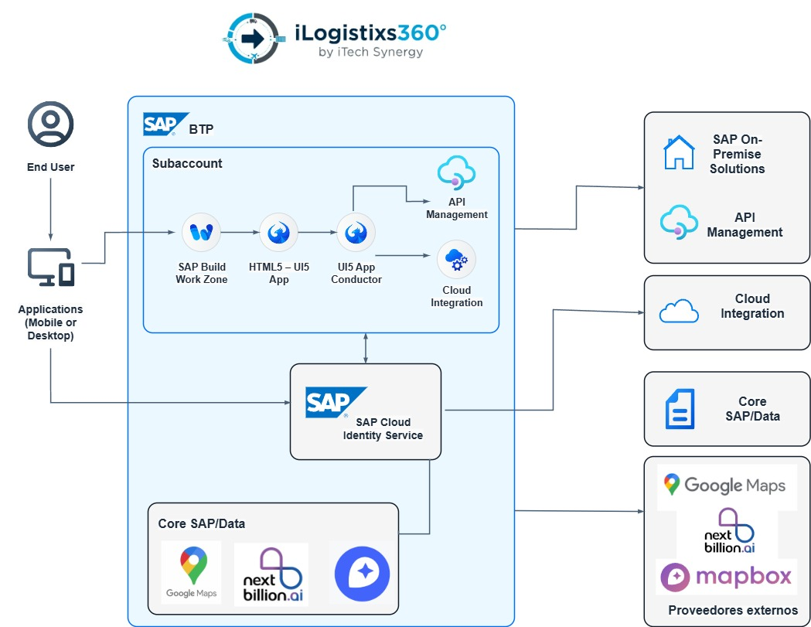

# iLogistixs 360 – Cold Chain App  
### by iTech Synergy



> **iLogistixs 360** es una solución inteligente desarrollada sobre **SAP Business Technology Platform (BTP)** para optimizar la **cadena de transporte**, integrando trazabilidad, transporte, consumo y satisfacción del cliente en una única plataforma web moderna basada en **SAPUI5**.

---

## Arquitectura General

La aplicación se ejecuta como un **SAP UI5 App (HTML5)** dentro de **SAP Build Work Zone**, utilizando servicios nativos de **SAP BTP**:

- **SAP Cloud Identity Service** → Autenticación centralizada.  
- **SAP Cloud Integration & API Management** → Integración de datos con sistemas SAP On-Premise.  
- **Google Maps / NextBillion.ai / Mapbox APIs** → Rutas inteligentes y geolocalización.  
- **SAP Core Data** → Procesamiento de órdenes, entregas y trazabilidad.

📘 Arquitectura general:



---

## Módulos de la Aplicación

| Módulo | Descripción |
|--------|--------------|
|  **Login** | Acceso con validación simulada de credenciales y sesión persistente. |
|  **Inicio** | Menú principal con navegación entre los procesos logísticos. |
|  **Transporte** | Visualiza los estados de entrega, rutas y control de temperatura. |
|  **Fabricación** | Monitoreo de procesos productivos y tiempos de salida. |
|  **Almacenaje** | Gestión de inventarios y control de cámaras frías. |
|  **Distribución** | Seguimiento de pedidos y validación de entregas. |
|  **Consumo** | Datos de satisfacción y calidad de producto final. |

---

##  Tecnologías Utilizadas

| Categoría | Tecnología |
|------------|-------------|
| **Frontend** | SAPUI5 / OpenUI5 (XML Views, MVC) |
| **Backend (Integración)** | SAP BTP - Cloud Integration |
| **Autenticación** | SAP Cloud Identity Services |
| **Mapas / Rutas** | Google Maps, NextBillion.ai, Mapbox |
| **Infraestructura** | SAP BTP Subaccount (CF Runtime) |
| **Diseño UI/UX** | CSS3 con gradientes y estilos corporativos iTech Synergy |

---

##  Ejecución local

1. Clona el repositorio:
   ```bash
   git clone https://github.com/Albertho245/ilogistixs360-coldchainapp.git
   cd ilogistixs360-coldchainapp
Instala dependencias:

bash
Copiar código
npm install
Inicia el servidor:

bash
Copiar código
npm start
Abre en tu navegador:

bash
Copiar código
http://localhost:8080/index.html
 Estilo visual
La app utiliza una interfaz limpia y moderna, con una paleta basada en:

Azul petróleo (#0a6ebd)

Verde menta (#9fe6cf)

Gris suave (#f4f4f4)

Blanco (#ffffff)

Terracota (#eabf9f)

 Autores y créditos
iLogistixs 360 Team – iTech Synergy

@Albertho245 – Desarrollador Principal

Arquitectura SAP BTP, SAPUI5 y Diseño de Interfaces

 Licencia
© 2025 iTech Synergy.
Proyecto educativo y demostrativo — uso interno y académico.

yaml
Copiar código

---

 **Siguiente paso:**
1. Crea un nuevo archivo en tu BAS llamado `README.md` (en la raíz del proyecto).  
2. Pega este contenido completo.  
3. Guarda y ejecuta:
   ```bash
   git add README.md
   git commit -m "Added professional README with architecture and branding"
   git push
